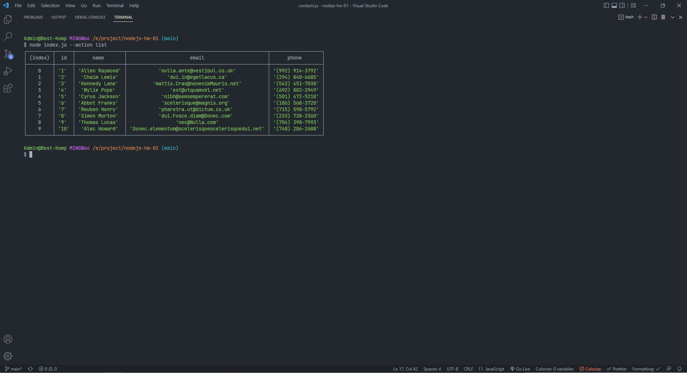
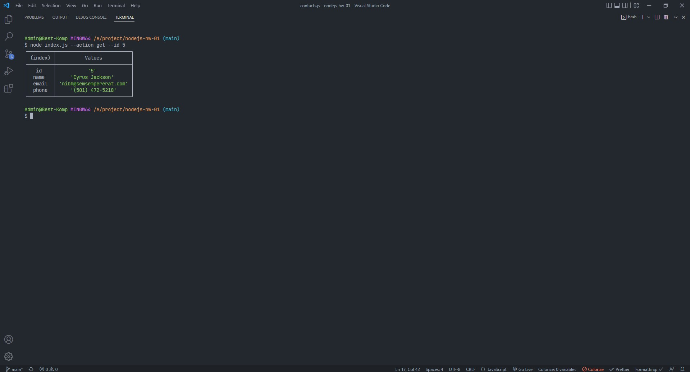
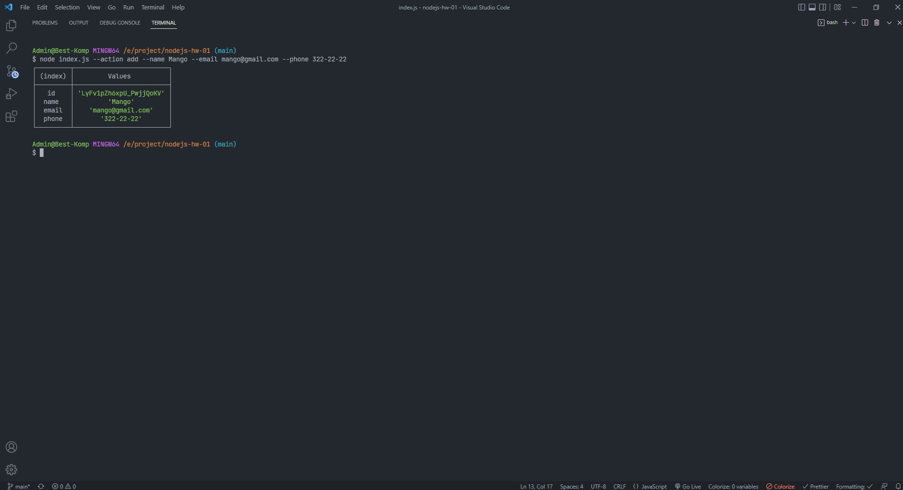
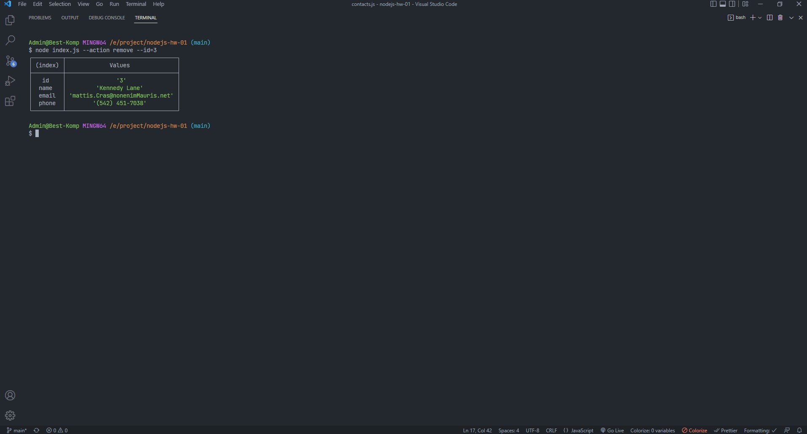

### Step 1

##### Initialized npm in the project. An index.js file has been created at the root of the project. Delivered nodemon package as a development dependency (devDependencies). In the package.json file added "scripts" to run index.js. start script which starts index.js using node start:dev script which starts index.js using nodemon.

### Step 2

##### The folder db is created at the root of the project. For storing contacts downloaded and used the contacts.json file is placed in the db folder. The contacts.js file has been created at the root of the project. Made import of fs and path modules to work with the file system. Variable created contactsPath and the path to the contacts.json file are written to it. To make a path path module methods are used. Added functions for working with a collection of contacts. The functions use the fs module and its readFile() and writeFile() methods. Made export of created functions via module.exports.

### Step 3

#### Made import of contacts.js module in index.js file and checked operability of functions for working with contacts.

### Step 4

#### In the index.js file, the yargs package is imported for convenient argument parsing command line. The invokeAction() function is used which receives the type the action to be performed and the necessary arguments. The function calls the corresponding method from the contacts.js file, passing it the necessary arguments.

### Step 5

#### Run commands in the terminal and take screenshots of the result execution of each command.

#### Get and display the entire list of contacts in the form of a table (console.table)

#### node index.js --action list

#### Get contact by id

#### node index.js --action get --id 5

#### Add a contact

#### node index.js --action add --name Mango --email mango@gmail.com --phone 322-22-22

#### Delete contact

#### node index.js --action remove --id=3

